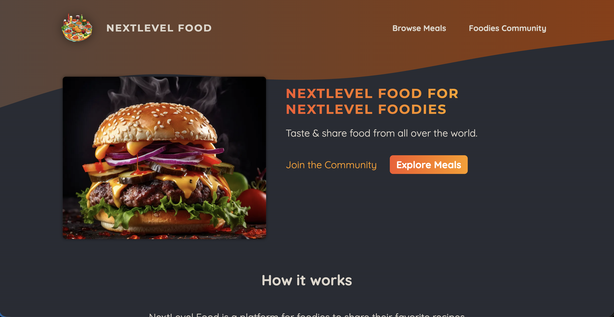
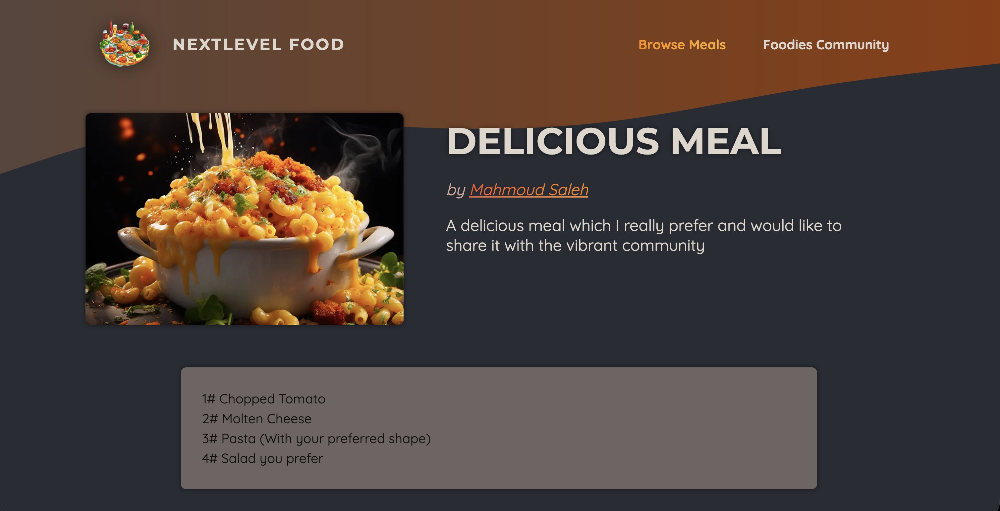
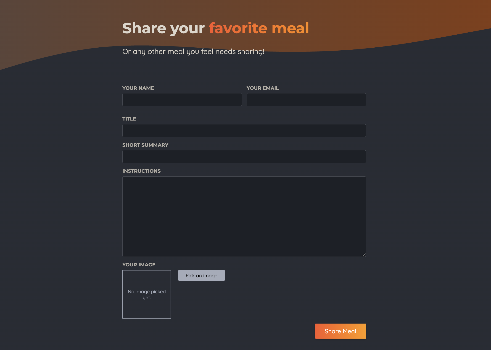

# 🍔 NextLevel Foodies – Full-Stack Next.js Application

NextLevel Foodies is a modern, full-stack food community platform built with **Next.js (App Router)**.  
The application allows users to explore meals, share recipes, and engage with a visually rich, food-focused experience.

This project demonstrates real-world full-stack development using modern web technologies, cloud storage, and scalable architecture.

---

## 🚀 Features

- Browse curated meals from the community  
- View detailed recipe pages with rich visuals  
- Share your favorite recipes  
- Community-driven food platform  
- Cloud-based image uploads  
- Optimized routing & performance with Next.js App Router  

---

## 🖼️ Screenshots

<table>
  <tr>
    <th>### Home Page</th>
    <th>### Browse Meals</th>
    <th>### Meal Details</th>
    <th>### Share Meal Form</th>
  </tr>
  <tr>
    <td>
      
    </td>
    <td>
      
    </td>
    <td>
      
    </td>
    <td>
      
    </td>
  </tr>
</table>

---

## 🛠️ Tech Stack

### Frontend
- Next.js 14+ (App Router)
- React
- CSS Modules
- Server Components & Dynamic Routes

### Backend
- Next.js Server Actions
- MongoDB
- AWS S3 (Image Storage)

---

## 🧠 What This Project Demonstrates

- Full-stack Next.js application using App Router  
- Server Actions for backend logic  
- MongoDB for data persistence (Currently SQLite locally is used as temp)
- AWS S3 integration for image uploads  
- Clean UI/UX with production-style architecture  
- Scalable and maintainable code structure  

---

## ⚙️ Environment Variables

Create a `.env.local` file in the root directory:

AWS_ACCESS_KEY_ID=your_access_key
AWS_SECRET_ACCESS_KEY=your_secret_key
AWS_S3_BUCKET_NAME=your_bucket_name


---

## 🏁 Getting Started

```bash
npm install
npm run dev

Open your browser at:
http://localhost:3000

🚧 Future Improvements

User authentication

Recipe comments & ratings

Favorites and bookmarks

Search & filtering

Pagination

👨‍💻 Author

Mahmoud Saleh

Senior Front-End Developer